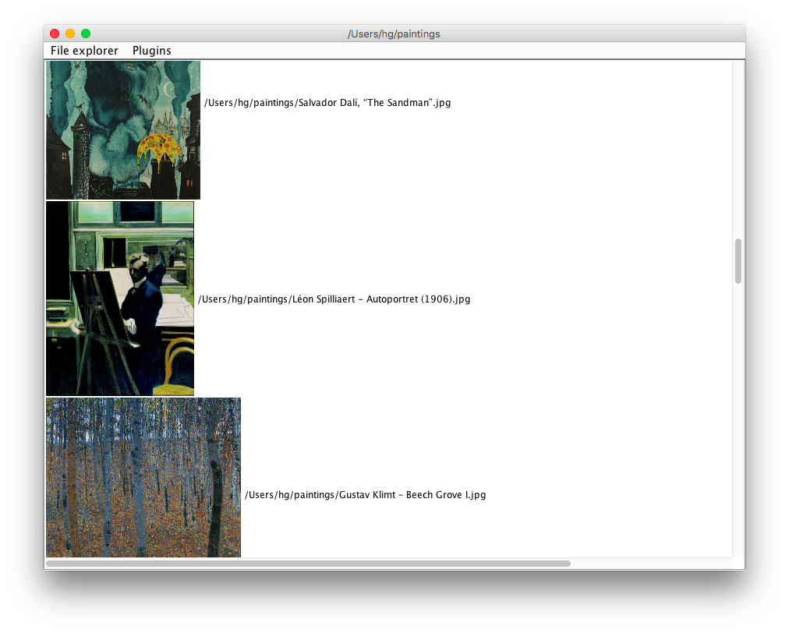
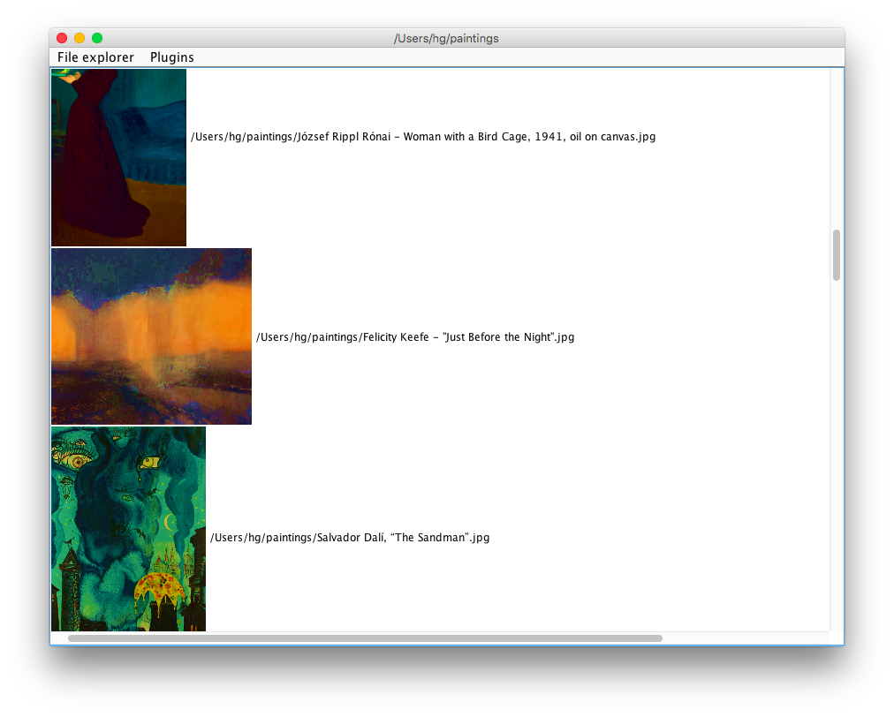
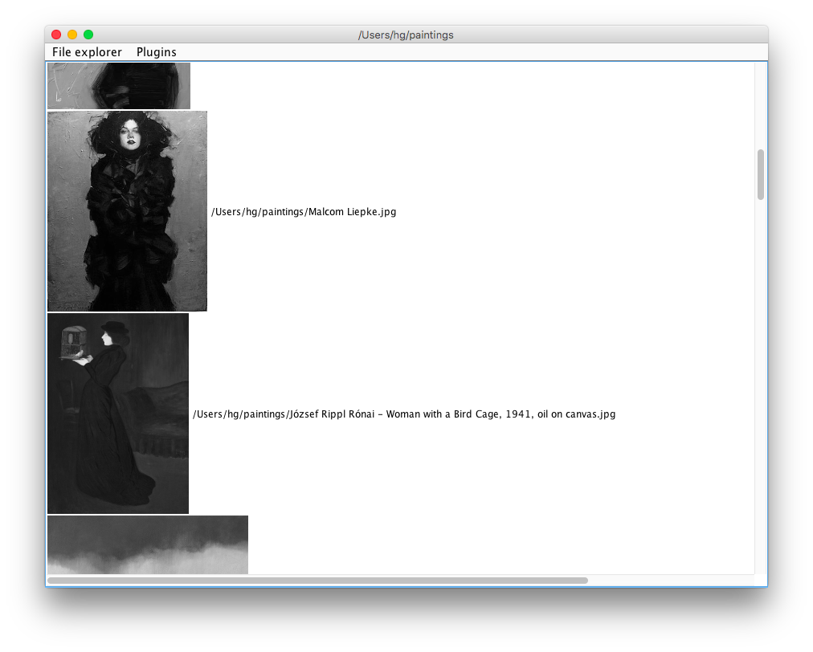
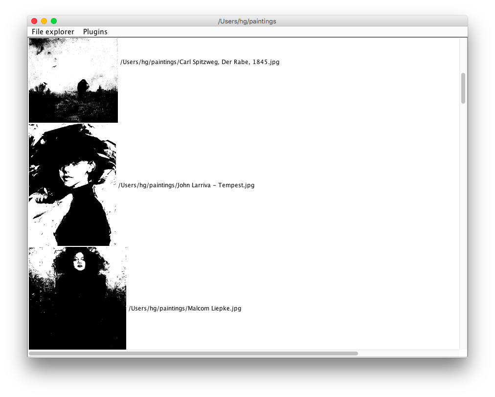
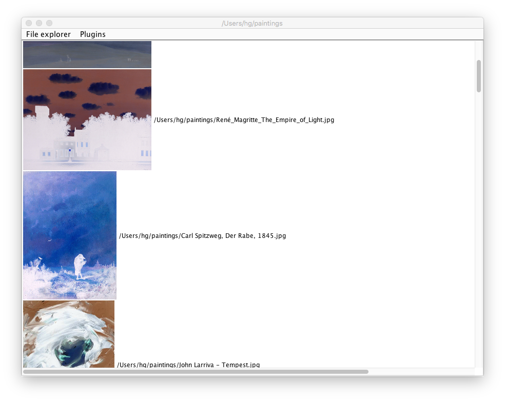

# barely-total-commander

The graphic files browser that enables navigation on files system.

In a separate thread image previews are loaded and stored in **weak references**.

There are also plugins implementing simple image transformation and loaded in runtime (ClassLoader):

- no plugin

- increase saturation

- gray scale

- black & white

- negative

